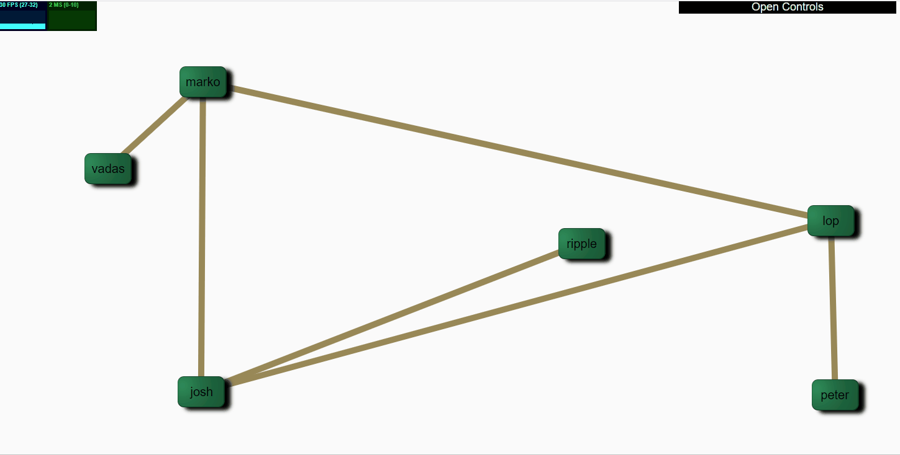

# Live demo

[network graph with physics](https://networkgraphs.github.io/graph2d/)

# Gif demo

Demo actions : 
 - keep left mouse down and drag vertex
 - right click on vertex to bring neighbors close by
 - drag empty area to pan the whole view
 - mouse wheel on empty area to zoom in and out (zoom centered on pointer location)
 - mouse wheel on vertex to scale vertices up and down.

# graph2d
Physics based network graph engine. Used for interactive graph exploration and morphing.

## concept introduction
A graph database can have thousands of vertices and edges. This engine is not intended for rendering a high number of vertices that would look like a cloud. It is rather targetting the user analysis of vertices containing readable labels. So even if a graph contains a high number of vertices, it is possible to start at an initial entry point, and start showing the required neighbors only. At each step, the user can pin the interesting vertex and continue the explration of the required path like a mind map opening process. It is also possible to decide of which vertex parameter is turned into a clusturing group, this way morphing the graph visibility to focus on the features the user is interested in.

# Design and Dependencies
## Candidates
### Graphics
Started with [SVG.js](https://svgjs.com/docs/3.0/) but was not convenient as it obscures the svg transform and the logic was more complex (at least to me to understand) than the svg specification, so vanilla js continued to be used and cleaning will be done to remove the dependency.
Other evaluated libearies but not kepts are [Pixi.js](https://www.pixijs.com/) (Render : webgl, Text, multi touch, webgl filters) and [Paper.js](http://paperjs.org/) (Canvas, Scene graph and special curves and shapes, using scriptographer)
### Physics
[matter.js](https://brm.io/matter-js/), quite a successfull choice, impressive library from usability and documentation. Takes physics simulation very serious with simulation steps corrections among others, has a lot of examples, included vectors library,...

## Graphs
* [GraphSON](https://github.com/thinkaurelius/faunus/wiki/GraphSON-Format) and GraphML importers implemented (without dependencies), the xml nature makes the dom parsing quite convenient for javascript. Other evaluated and might be added (Vis.js for .dot import, .graphml, .gml, GEFX, .gv)

## Other dependencies
* stats.js : 0.17.0
* gui.js : as module

# Development
## progress
* drag and drop a file
* multi windows svg and physics debug renderer
* svg vertices and edges (basic)
* configurable dat.gui with persistance
* custom forces for horizontality adjustment of vertices
* custom forces for neighbors field attraction
* hover highlighting neighbors
* hover highlighting neighbors edges
* svg filters for drop shadow, light and displacement
* mouse wheel on vertices scales vertices and their labels
* mouse drag on background pan zoom overall view, with mouse centered zoom
* drag nodes with mouse
* mouse button variants with touch number

## implementation plan
* lighten non neighbors to ease movement of neighbors
* hover highlighted siblings push each other when too close
* remove border walls
* initial layout using static algorithm
* add vertices context menu for graph configuration
* left click to fix, right click for config (touch, hold)
* add edges labels
* create display for groups
* convert properties to colors
* convert proerties to groups
* convert properties to node relative size

## issues
* displacement filter in edges results sometimes on a thin down to invisible edge
* dragging nodes selects the labels text, which results on a text drag and drop on the next step. To be avoided by disallowing text selection. Issue relates to the physics engine handling the mouse events and not stopping the propagation.
* performace slowdown on S10+ down to 5 FPS with "LesMiserables" (40 ms inconsistent), 23 FPS 18 ms on PC

# General Features
* drag and drop to import graph files (standard .dot, custom .json)
* right click on vertex/edge for config and on empty for graph config
* map node properties to 
  * color
  * size
  * visibility
* properties can switch to nodes
* switch property->node->group (a node disappears with all its edges and becomes a clusturing group)
* vertex or edge properties shall not define visualisation properties (visibility, size, color, position, groups)

## Vertices
* hover effect to highlight neighbours
* pin unpin vertices with clicks disables force influence
* mouse drag vertices to move them
* specific vertex config can bring neighbors closer or make them visible

## Layout
* vertices cluster themselves with neighborhood affinity
* vertices initial layout uses forces not fixed constraints
* neightbors attract with weight factor and non neighbors repulse
* inter-groups neighbors attract to bring groups closer together

## groups
* groups interact with nodes using physical contraints
* nodes in groups attraction
* nodes out of groups repulsion
* group shape forces (with fixed or free shape ratios)
* repulsion of non group members (optional for shapeless groups)
* groups can be hierarchical
* groups can intersect with nodes belonging to more than one group

## Edges
* edges do not influence the initial layout
* edges weight configurable with or without constraint and the constraint has configurable params

## Graph capabilities
* Graph is static but visibility and properties mapping are dynamic
* Node list
* Edge list
* Every Node will have a Neighbors list (from the edge list)
* A Node has custom properties
* An Edge has custom properties
* element properties can be hirarchical documents

## Properties mapping
* State properties can map to groups
* linear properties can map to color
* clusturing of properties can map to visualisation location clusturing
* it is possible to cluster any number, even all properties together
* properties swapped to nodes can have a high edges count (or link to all nodes)
* properties swapped to nodes will have a limited set of properties or no properties
* properties can swap to a clustured number of nodes within a group depending on the type of the property

## Visualisation properties
### Size and visibility
* size of vertices to be defined with screen resolution (mobile friendly)
* size and visibility go together with an importance factor

### Labels
* label has to be contained within the node size
* label minification go through the short version (if available), the id or get hidden depending on node size restrictions
### Style and color
* node background color has to contrast the label color
* node outline can have a thickness and glow
* node shape can be rectangular, elliptic or take any svg path

# Graph format
Most formats have node edge list with properties. edge labels and weights are optional.
Mandatory parameters are :
* Node id
* Node label (as this is content graph display and not abstract graphs)
* Edge id
* Edge source
* Edge target

## Graph formats list
* graphson : graph in json from Apache Tinkerpop. node edge list.
* graphml : node edge list, xml. Flat, all keys, nodes lists at top level.
* gefx : node edge list, xml. Grouped into nodes and edges elements.
* gdf : node edge list, csv
* gml : node edge list, yaml

## graphson
* [GraphSon_blueprint.json](graphs/GraphSON_blueprints.json) taken from [GraphSON Reader and Write](https://github.com/tinkerpop/blueprints/wiki/GraphSON-Reader-and-Writer-Library)

## graphml
* [The GraphML File Format](http://graphml.graphdrawing.org/)
* [non normative details of GraphML](http://graphml.graphdrawing.org/primer/graphml-primer.html)

# References
## SVG CSS
* http://tinkerpop.apache.org/docs/3.4.4/dev/io/#graphson
* [SVG w3.org](https://www.w3.org/TR/SVG/Overview.html)
* [SVG Filters](https://developer.mozilla.org/en-US/docs/Web/SVG/Element/filter)
* [CSS Filters](https://developer.mozilla.org/en-US/docs/Web/CSS/filter)

## Graph javasctipt libraries
* [Cytoscape](https://js.cytoscape.org/) : Graph theory (network) library for visualisation and analysis
* [Sigma.js](http://sigmajs.org/) : Sigma is a JavaScript library dedicated to graph drawing. It makes easy to publish networks on Web pages, and allows developers to integrate network exploration in rich Web applications.

# Samples
* [The eyes have it](https://codepen.io/shubniggurath/pen/RqYxoz)

